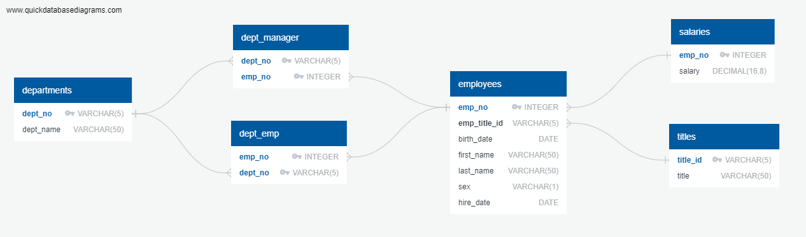

# sql-challenge
A research project about people from Pewlett Hackard (a fictional company) employed during the 1980s and 1990s.

Pewlett Hackard has some questions which will help them make HR decisions. The questions are: 
 1. List the employee number, last name, first name, sex, and salary of each employee.
 2. List the first name, last name, and hire date for the employees who were hired in 1986.
 3. List the manager of each department along with their department number, department name, employee number, last name, and first name.
 4. List the department number for each employee along with that employee’s employee number, last name, first name, and department name.
 5. List first name, last name, and sex of each employee whose first name is Hercules and whose last name begins with the letter B.
 6. List each employee in the Sales department, including their employee number, last name, and first name.
 7. List each employee in the Sales and Development departments, including their employee number, last name, first name, and department name.
 8. List the frequency counts, in descending order, of all the employee last names (that is, how many employees share each last name).

The information is stored on flat CSV files. They are located on the data folder. The files were uploaded onto a database with the following schema: 

The queries to answer the questions can be found on [Answers](./EmployeeSQL/Answers.sql)

The results from the questions can be found on the [EmployeeSQL](./EmployeeSQL/) directory. 

PS: ERD and create SQL statments are generated by [QuickDatabaseDiagrams](https://www.quickdatabasediagrams.com/) website. 
